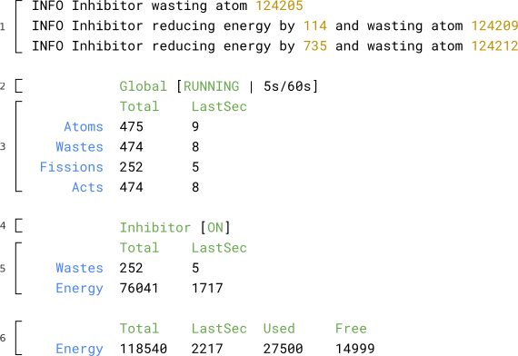
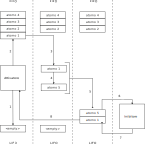

__Mattia Mignogna__ (matr. 1043330) \hfill __Fabio Nebbia__ (matr. 898514)

\hspace{0pt}
\vfill
\center
# Progetto di Sistemi Operativi {.unnumbered .unlisted}
## Versione NORMAL {.unnumbered .unlisted}
### A.A. 2023/2024 {.unnumbered .unlisted}
\vfill
\hspace{0pt}

\pagebreak
\tableofcontents
\pagebreak

\flushleft


# Premesse

## Sviluppo

| Il progetto è stato sviluppato, compilato e testato su:
|
|

+--------+-----------------------+-------------------------------+-------------------------+
|        | \textbf{Arch Linux}*  | \textbf{Ubuntu 22.04.3 LTS}** | \textbf{Ubuntu 23.10}** |
+========+=======================+===============================+=========================+
| `gcc`  | 13.2.1                | 11.4.0                        | 13.2.0                  |
+--------+-----------------------+-------------------------------+-------------------------+
| `gdb`  | 14.1                  | 12.1                          | 14.0                    |
+--------+-----------------------+-------------------------------+-------------------------+
| `make` | 4.4.1                 | 4.3  TODO                     | 4.3                     |
+--------+-----------------------+-------------------------------+-------------------------+

| * usato per lo sviluppo e il testing.
| ** usato per il testing.
|
|


## Compilazione ed esecuzione del progetto

Tutte le operazioni di controllo della simulazione si effettuano tramite lo script BASH `soctl.sh`, presente
nella cartella del progetto. Lo script compila automaticamente tutti i moduli del progetto invocando `make`
e predispone l'environtment per l'esecuzione delle simulazioni.  

| Seguono alcuni esempi di utilizzo.
|
|

+-------------------------------------------------------------------------------------+--------------------------------------------------------------------------------------------------------------------+
| **Comando**                                                                         | **Effetto**                                                                                                        |
+=====================================================================================+====================================================================================================================+
+-------------------------------------------------------------------------------------+--------------------------------------------------------------------------------------------------------------------+
| `./soctl.sh --help`                                                                 | Stampa la lista esaustiva dei comandi a disposizione, le relative shortcut e la corrispondente sintassi.           |
+-------------------------------------------------------------------------------------+--------------------------------------------------------------------------------------------------------------------+
+-------------------------------------------------------------------------------------+--------------------------------------------------------------------------------------------------------------------+
| `./soctl.sh start --explode --inhibitor`                                            | Carica la configurazione per lo scenario di explode e attiva l'inibitore all'avvio della simulazione.              |
+-------------------------------------------------------------------------------------+--------------------------------------------------------------------------------------------------------------------+
+-------------------------------------------------------------------------------------+--------------------------------------------------------------------------------------------------------------------+
| `./soctl.sh start --meltdown`                                                       | Carica la configurazione per lo scenario di meltdown e **non** attiva l'inibitore all'avvio della simulazione.     |
+-------------------------------------------------------------------------------------+--------------------------------------------------------------------------------------------------------------------+
+-------------------------------------------------------------------------------------+--------------------------------------------------------------------------------------------------------------------+
| `./soctl.sh inhibitor toggle`                                                       | Attiva o disattiva l'inibitore a simulazione in corso.                                                             |
+-------------------------------------------------------------------------------------+--------------------------------------------------------------------------------------------------------------------+
+-------------------------------------------------------------------------------------+--------------------------------------------------------------------------------------------------------------------+
| `./soctl.sh stop`                                                                   | Termina manualmente la simulazione in corso.                                                                       |
+-------------------------------------------------------------------------------------+--------------------------------------------------------------------------------------------------------------------+
+-------------------------------------------------------------------------------------+--------------------------------------------------------------------------------------------------------------------+

\pagebreak


## Interpretazione della stampa delle statistiche

|
| Ogni secondo sarà prodotto a video un output di questo tipo:
|
|
|

{ width=65% }

|
|

Dove il significato di ogni sezione delineata corrisponde a:

1. Log opzionalmente prodotti dall'inibitore in caso sia attivo e il suo log sia abilitato
   (ossia non sia stato passato a `./soctl.sh start` il flag `--no-inh-log`).
   Queste indicano, ad ogni scissione, l'energia che è stata assorbita dall'inibitore
   (se necessario ad evitare `EXPLODE`) e l'atomo che è stato convertito in scoria (per evitare `MELTDOWN`).

<!-- -->

2. Stato globale della simulazione (`RUNNING`, `TIMEOUT`, `EXPLODE`, `BLACKOUT`, `MELTDOWN`, `TERMINATED`),
   seguito dal numero di secondi restanti alla terminazione per `TIMEOUT` e dalla durata totale configurata per la stessa.

<!-- -->

3. Riporta il numero di atomi, scorie, fissioni e attivazioni avvenute in totale dall'inizio della simulazione e quelle relative all'ultimo secondo.

<!-- -->

4. Stato dell'inibitore (`ON` oppure `OFF`), quest'ultimo può essere attivato o disattivato in qualsiasi momento usando gli appositi comandi (vedere `./soctl.sh --help`).
   Di conseguenza, le relative statistiche (sezione 5), varieranno (o meno) a seconda di quando e come viene manipolato.

<!-- -->

5. Riporta il numero di atomi trasformati in scoria dall'inibitore e la quantità di energia assorbita dallo stesso,
   in totale dall'inizio della simulazione e relativamente all'ultimo secondo.

<!-- -->

6. Riporta l'energia prodotta in totale dalla simulazione, quella prodotta nell'ultimo secondo, quella consumata in totale
   dal master da inizio simulazione e quella correntemente libera.

\pagebreak

# Scelte progettuali

## Programmazione modulare

### Suddivisione in moduli e librerie

| Il progetto è così genericamente strutturato:
|
|

```txt
project/
  |
  +-- <module>        // tutti i moduli principali (omessi per brevità)
  |
  +-- bin/            // contiene i binari compilati 
  |
  +-- env/            // contiene le configurazioni per i vari scenari
  |
  +-- libs/
  |    |
  |    +-- impl/      // implementazioni delle librerie
  |    |
  |    +-- lib/       // header delle librerie
  |
  +-- makefile        // per compilare i moduli e le librerie
  |
  +-- soctl.sh        // per il controllo da terminale della simulazione
```

|
|
| Ogni processo è implementato in un modulo separato da tutti gli altri e viene così immesso nella simulazione:

- Il master avvia alimentatore, attivatore, inibitore e `N_ATOMI_INIT` tramite `fork` e successiva `execv`;
- L'alimentatore immette `N_NUOVI_ATOMI` atomi tramite `fork` e successiva `execv`;
- Diverge l'atomo, che si scinde tramite la sola `fork`.

|
| Alcuni moduli particolari sono:

- `model`, compilato insieme ad ogni modulo principale, che fa uso delle direttive del preprocessore
  per assumere la struttura adeguata per il particolare processo che si sta compilando
  ([[sezione 2.1.2 TODO]{.underline}][Utilizzo di make e makefile]);
- `inhibitor_ctl`, utilizzato tramite `./soctl.sh inhibitor` per controllare lo stato dell'inibitore a run-time.

|
| Sono state realizzate librerie condivise, compilate una sola volta, per implementare le seguenti funzionalità:

- Interazione con la FIFO ([[sezione 2.3.1 TODO]{.underline}][FIFO]);
- Interazione con la LIFO ([[sezione 2.3.2 TODO]{.underline}][LIFO in shared memory]);
- Interazione con i semafori ([[sezione 2.4 TODO]{.underline}][Inibitore e ciclo di attivazione e scissione]);
- Signal handling e signal (un)masking ([[sezione 2.4 TODO]{.underline}][Inibitore e ciclo di attivazione e scissione]);
- Interazione con le memorie condivise;
- Stampa formattata su console;
- Util generiche (math utils, timer, passaggio di argomenti tramite `execv`, file temporanei, ecc).

|
| Sono anche presenti alcuni header non associati a librerie:

- `libs/lib/config.h`, che consente a tutti i processi di accedere facilmente alla configurazione in shared memory;
- `libs/lib/ipc.h`, che contiene informazioni utili ai processi per comunicare tra loro.

\pagebreak

### Utilizzo di make e makefile

Il `makefile` contiene le opportune direttive per:

- Compilare tutte le librerie;
- Compilre `inhibitor_ctl`, per essere usato tramite ` ./soctl.sh inhibitor`;
- Compilare i moduli di tutti i principali processi, ciascuno con applicate le opportune differenze in `model`;

|
| Sono state utilizzate diverse funzionalità di `make`, tra cui:

- `%`, per eseguire il matching del nome del modulo che si intende compilare;
- `$@`, `$^`, `$<`, per automatizzare la compilazione senza ripetere i nomi di target/prerequisiti;
- `eval` e `shell`, per la `#define` automatica del nome del modulo (es. `-DMASTER`);
- `addprefix`, per abbreviare la stesura del `makefile` stesso;
- `filter`, per selezionare i file corretti da passsare a `gcc`.

|
| Inoltre, per `gcc` sono state utilizzate flag quali:

- `-g`, per eseguire il debugging tramite `gdb`;
- `-I<dir>`, per indicare le directory in cui cercare gli header delle librerie condivise;
- `-L<dir>`, per indicare la directory in cui il linker può reperire le librerie condivise;
- `-l:<library>`, per indicare al linker i file binari delle singole librerie condivise.

|
| Consultare direttamente il `makefile` per visionare come sono state impiegate tali funzionalità.

## Configurazione

La configurazione di una simulazione è stata realizzata tramite variabili d'ambiente.  

Il master ne effettua la lettura e, accertata la loro correttezza, le inserisce in memoria condivisa in modo che
tutti gli altri processi vi abbiano immediato accesso, senza eseguire a loro volta letture e parsing numerico.

## Gestione dei pid dei processi atomo

La gestione dei pid è stata ottimizzata allo scopo di massimizzare il numero di scorie prodotte per ridurre al minimo il rischio di `MELTDOWN`.  

Per fare questo, dato che il numero atomico è randomico ed è un'informazione privata del processo atomo, ci si è basati
sull'euristica per cui un atomo, man mano che viene scisso, vede un progressivo decadimento del suo numero atomico:
è più probabile che un atomo scisso abbia numero atomico minore e sia quindi più prossimo al diventare scoria.

Per separare gli atomi "nuovi", ossia quelli che ancora non hanno subito scissioni, da quelli che, invece, si sono scissi
più recentemente, si è scelto di usufruire di due strutture dati differenti:

- Quelli "nuovi", immessi dal master e dall'alimentatore, sono memorizzati in una FIFO;
- Quelli scissi dall'attivatore sono memorizzati in una LIFO (implementata in shared memory).
  La natura stessa della struttura dati permette di tenere traccia degli atomi scissi più recentemente e,
  quindi, del progressivo decadimento del relativo numero atomico.

### FIFO

Gli atomi immessi nella simulazione dal master e dall'alimentatore memorizzano automaticamente il relativo pid nella FIFO,
in quanto è impossibile avere informazioni sul loro numero atomico e si è scelto di processarli in ordine di immissione
nella simulazione.

### LIFO in shared memory

Gli atomi più recentemente scissi dall'attivatore, ammesso che non si traformino in scorie, memorizzano il proprio pid
nella LIFO. Quest'ultima risiede in shared memory, in modo tale che sia accessibile a tutti i processi che devono manipolarne
lo stato (le manipolazioni effettuate saranno dettagliate in [[sezione 2.3 TODO]{.underline}][Inibitore e ciclo di attivazione e scissione]).

L'implementazione data, a seconda del fabbisogno determinato dalla configurazione della simulazione, è automaticamente
in grado di aumentare (o diminuire) lo spazio riservato per la LIFO (richiedendo al SO un nuovo segmento di shared memory delle
opportune dimensioni, copiando i dati pre-esistenti e rilasciando il segmento precedente).

|

## Inibitore e ciclo di attivazione e scissione

Durante ogni secondo della simulazione si ripeteranno diversi cicli di attivazione e scissione, sulla base della configurazione,
in particolare del parametro `STEP_ATTIVATORE`.

| Segue un esempio generico.
|
|

{ width=65% }

Quando un atomo riceve un `SIGACTV` dal processo attivatore, ammesso che non debba trasformarsi in scoria,


## exit in qualsiasi punto senza leak